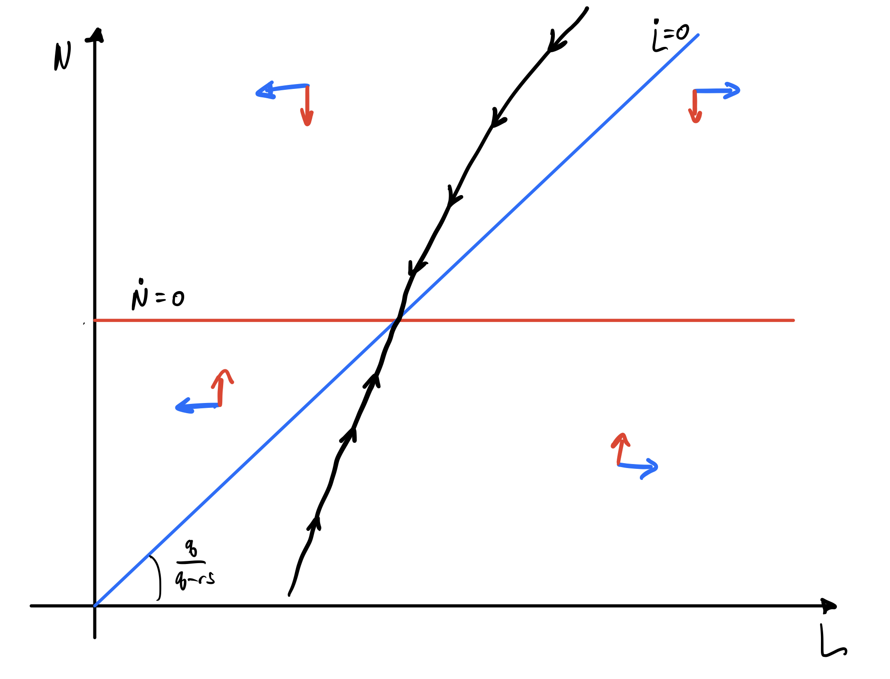

ECON 2080, part 1  
Spring 2022  
Pascal Michaillat  
Brown University

# Problem Set 2: Solutions

### Problem A (6 points)

**Consider a matching model with a labor force of size $H$. The matching function is  Cobb-Douglas:  $m(U,V) = \omega \cdot U^{\eta} \cdot V^{1-\eta}$, where $U$ is the number of unemployed workers, $V$ is the number of vacant jobs, and $\eta\in (0,1)$ is the matching elasticity. All workers are paid at a minimum wage $w>0$. Firms have a production function $y(N) = a \cdot N^{\alpha}$, where $a$ governs labor productivity, $N$ denotes the number of producers in the firm, and $\alpha \in (0,1)$ indicates diminishing marginal returns to labor. Firms incur a recruiting cost of $r > 0$ recruiters per vacancy and face a job-destruction rate $s > 0$. The labor market tightness is $\theta = V/U$.**

1. **Compute the job-finding rate $f(\theta)$ and vacancy-filling rate $q(\theta)$. Assuming that labor-market flows are balanced, compute the recruiter-producer ratio $\tau(\theta)$.**

The job-finding rate $f(\theta)$ is

$$f(\theta) = \frac{m(U,V)}{U} = m(1,\theta) = \omega \theta^{1-\eta}.$$

The vacancy-filling rate $q(\theta)$ is

$$q(\theta) = \frac{m(U,V)}{V} = m\left(\theta^{-1},1\right) = \omega \theta^{-\eta}.$$

Using $rV = R$ and $L = N + R$, the assumption of balanced flows implies

$$s L = q(\theta) V \Rightarrow r s(N+R) = q(\theta) R.$$

Dividing both sides by $R$, then rearranging for $\tau$ gives

$$rs\left(1+\tau^{-1}\right) = q(\theta),$$

so

$$rs\tau^{-1} =q(\theta) - rs,$$

which finally implies 

$$\tau(\theta) = \frac{rs}{q(\theta)-rs}$$

where $q(\theta) = \omega \theta^{-\eta}$.

2. **Assuming that labor-market flows are balanced, compute labor supply $L^s(\theta,H)$.**

Using $H = L + U$ and the assumption that flows are balanced, we find

$$sL = f(\theta) U \Rightarrow sL = f(\theta)(H-L).$$

We rearrange terms to isolate $L$ and obtain the labor supply:

$$L^s(\theta) = \frac{f(\theta)}{s+f(\theta)}H .$$

where $f(\theta) = \omega \theta^{1-\eta}$.

3. **Firms choose employment to maximize flow profits: $y(N) - [1+\tau(\theta)] \cdot w \cdot N$. Compute the labor demand $L^d(\theta,a,w)$ by solving this maximization problem.**

Firms solve

$$\max_{N} a N^{\alpha} - [1+\tau(\theta)] w N.$$

The first-order condition is

$$a \alpha N^{\alpha-1} = [1+\tau(\theta)] w.$$

Using $L = [1+\tau(\theta)]N$, we rewrite the first-order condition:

$$a \alpha [1+\tau(\theta)]^{1-\alpha} L^{\alpha-1} = [1+\tau(\theta)]w.$$

Isolating $L$, we then gets

$$L^{\alpha-1} = [1+\tau(\theta)]^{\alpha} \frac{w}{a \alpha}.$$

Taking both sides to the power of $1/(\alpha-1)$, we finally obtain

$$L^d(\theta) = \left(\frac{a \alpha }{w [1+\tau(\theta)]^{\alpha}}\right)^{\frac{1}{1-\alpha}}$$

where $1 + \tau(\theta) = q(\theta)/[q(\theta)-rs]$.

4. **Give the equation that determines tightness in the model. Explain the origin of this equation.**

The model has two key variables: vacancies $V$, determined by firms to maximize profits, and employment $L$, which is determined by the matching process and vacancies. All other variables can be detemined from $V$ and $L$ and the assumptions:

* Unemployment is $U = H - L$
* Tightness is $\theta = V/U$
* The job-finding and vacancy-filling rates are $f = f(\theta)$ and $q = q(\theta)$
* The recruiter-producer ratio is $\tau = \tau(\theta)$
* The number of producers and recruiters are $N = L/(1+\tau)$ and $R = \tau L/(1+\tau)$ 

So solving the model is tantamount to solving a system of two equations with two variables are $V$ and $L$. The two equations are the firm's profit-maximizing condition and the balanced-flow condition.

Of course, we are free to re-express the two equations in any form we want, and combine them if we want. We are also free to pick two other variables than $V$ and $L$ if we would like, as long as there is a one-to-one mapping between the two new variables and $[V,L]$.

It is convenient to express the model with $\theta$ and $L$ as the two variables. This is because it is easy to express all other variables as a function of tightness, and because tightness determines the trading probabilities $f$ and $q$ that workers and firms take as given. Of course, $[\theta,L]$ and $[V,L]$ are related by a one-to-one meeting since $V = \theta \times (H-L)$.

We can write the two equations describing the model as $L = L^d(\theta)$ and $L = L^s(\theta)$. The first equation describes the amount of workers that firms employ to maximize profits. The firms then posts the appropriate number of vacancies to achieve that employment level. The second equation describes the amount of workers who are employed through the matching process.

To solve the model, we combine the two equations so as to eliminate $L$. We end up with one equation (labor supply  = labor demand) of one variable ($\theta$). Indeed, the tightness $\theta$ that solves the model satisfies

$$L^s(\theta) = L^d(\theta).$$

This equation implicitly determines $\theta$.

We can write the supply-equals-demand equation in a slightly more explicit form:

$$\frac{f(\theta)}{s+f(\theta)}H = \left(\frac{a \alpha }{w [1+\tau(\theta)]^{\alpha}}\right)^{\frac{1}{1-\alpha}}.$$

The left-hand side is increasing from 0 to $\infty$ when $\theta$ increases from 0 to $\infty$. The right-hand side is decreasing from $(a\alpha/w)^{1/(1-\alpha)}>0$ to 0 when $\theta$ increases from 0 to $\theta^m$, we know that the equation admits a unique solution on $[0,\theta^m]$. ($\theta^m$ is defined by $\tau(\theta^m) = \infty$ or $q(\theta^m) = rs$.)

5. **Using the equation that you have just obtained, compute the elasticity of tightness with respect to the minimum wage, $\epsilon^{\theta}_w$. Is the elasticity positive or negative? Discuss your finding in light of the empirical literature on the minimum wage.**

First lets work out a few useful elasticities using the tricks for working with elasticities from [lecture video 50](https://www.pascalmichaillat.org/v50.html). 

Using the fact that the elasticity of $g(x) = a x^{\alpha}$ is $\epsilon^g_x = \alpha$, we find

$$\epsilon^f_\theta = (1-\eta), \quad \epsilon^q_{\theta} = -\eta, \quad \epsilon^{L^d}_{w} = -\frac{1}{1-\alpha}.$$

Using the fact that the elasticity of $g(x) = a(x) + b(x)$ is $\epsilon^g_x = \frac{a(x)}{a(x)+b(x)}\epsilon^a_x + \frac{b(x)}{a(x)+b(x)}\epsilon^b_x$, we find

$$\epsilon^{s+f(\theta)}_{\theta} = \frac{f(\theta)}{s+f(\theta)}\epsilon^f_{\theta} = (1-u) \epsilon^f_{\theta}, \quad \epsilon^{q(\theta) - rs}_{\theta} = \frac{q(\theta)}{q(\theta)-rs} \epsilon^q_{\theta} = [1+\tau]\epsilon^{q}_\theta,$$

where $u = U/H = s/[s+f(\theta)]$ is the unemployment rate, and 

$$\epsilon^{1+\tau}_\theta = \frac{\tau(\theta)}{1+\tau(\theta)}\epsilon^{\tau}_{\theta}.$$

Using the fact that the elasticity of $g(x) = a(x)b(x)$ is $\epsilon^g_x = \epsilon^a_x + \epsilon^b_x$, we obtain 

$$\epsilon^{L^s}_\theta = (1-\eta) - \frac{f(\theta)}{s+f(\theta)}(1-\eta)= \frac{s}{s+f(\theta)}(1-\eta) = u \cdot (1-\eta),  \quad \epsilon^\tau_{\theta} = [1+\tau(\theta)]\eta.$$

The last equation implies that $\epsilon^{1+\tau}_{\theta} = \tau(\theta) \eta$, which together with the expression for the labor demand implies that

$$\epsilon^{L^d}_{\theta} = -\frac{\alpha}{1-\alpha} \eta \tau(\theta).$$

For any function $x \mapsto f(x)$ and any small change $d\ln x$, we have  $d \ln f = \epsilon^f_x \cdot d\ln x$. Applying this linearization to the labor-supply curve, we find that 

$$d \ln L^s = \epsilon^{L^s}_\theta \cdot d \ln \theta = u(1-\eta) \cdot d\ln \theta.$$

Holding labor productivity $a$ fixed, labor demand is a function of tightness and wages: $L^d(\theta,w).$ Using the linearization $d \ln f(x,y) = \epsilon^f_x \cdot d\ln x + \epsilon^f_y \cdot d\ln y$, we obtain

$$d\ln L^d = \epsilon^{L^d}_{\theta}\cdot  d\ln \theta + \epsilon^{L^d}_{w} \cdot  d\ln w,$$

which then gives

$$d\ln L^d = -\frac{\alpha}{1-\alpha} \eta \tau(\theta) \cdot d \ln \theta - \frac{1}{1-\alpha} \cdot d \ln w.$$

The condition $L^s(\theta) = L^d(\theta,w)$ holds both before and after any shock. So it holds before and after a shock to the wage $w$. This implies that the changes in labor supply and labor demand triggered by the shock must be equal:

$$d \ln L^s = d \ln L^d.$$

Plugging in the values of $d\ln L^s$ and $d \ln L^d$ yields

$$u(1-\eta) \cdot d\ln \theta = -\frac{\alpha}{1-\alpha} \eta \tau(\theta) \cdot d \ln \theta - \frac{1}{1-\alpha} \cdot  d \ln w$$

Rearranging the terms, we infer the change in tightness created by the change in wage:

$$d \ln \theta = \frac{-1}{u(1-\eta)(1-\alpha)+ \alpha \eta \tau(\theta)} \cdot d \ln w.$$

Tightness adjusts as much as necessary to make sure that labor supply remains equal to labor demand after the shock.

We can re-express this result to obtain the elasticity of tightness with respect to the minimum wage:

$$\epsilon^{\theta}_w = \frac{d \ln \theta}{d \ln w} = \underbrace{-\left[\underbrace{u(1-\eta)(1-\alpha)}_{>0}+\underbrace{\alpha \eta \tau(\theta)}_{>0} \right]^{-1}}_{<0}.$$

The elasticity is negative. The model predicts that raising the minimum wage decreases tighteness -- it decreases the number of vacancies per unemployed worker. 

The empirical literature on the minimum wage finds mixed results: see for instance this [2007 survey](https://www.nber.org/papers/w12663) and this [earlier review of Card and Krueger's book](https://www.princeton.edu/~tleonard/papers/minimum_wage.pdf) and this [2021 survey](https://www.nber.org/papers/w28388).

The neoclassical answer is that a higher minimum wage should increase unemployment, which is consistent with the sign of the elasticity in the matching model. In some monopsony models of the labor market, by contrast, raising the minimum wage can actually increase employment.

6. **Now assume that productivity depends on the wage: $a(w) = \mu \cdot w^{\beta}$ with $\mu>0$ and $\beta>0$. Give possible reasons why $\beta>0$. Recompute the elasticity of tightness with respect to the minimum wage under this new assumption. How does your answer compare with the answer you gave in Question 6?**

$\beta$ might be greater than zero because a higher wage might induce more effort at work, either because the worker feels some loyalty or indebtedness to their employer, or because the worker has higher incentives to keep their job. This is the logic highlighted by the [efficiency-wage literature](https://www.jstor.org/stable/1816334). In practice, wages are often linked to some sort of incentive-based bonus package, so it is also possible that wages are set up to directly increase productivity by incentiving increased effort in exchange for higher wages.

The only step of the elasticity calculation from Question 5 that changes is $\epsilon^{L^d}_{w}$. Now we have

$$L^d(\theta,w) = \left(\frac{\mu w^{\beta-1}\alpha }{[1+\tau(\theta)]^{\alpha}}\right)^{\frac{1}{1-\alpha}}.$$

This means that the elasticity of labor demand with respect to 

$$\epsilon^{L^d}_w = \frac{\beta-1}{1-\alpha}.$$

The supply-equals-demand condition then implies

$$u(1-\eta) \cdot d\ln \theta = -\frac{\alpha}{1-\alpha} \eta \tau(\theta) \cdot d \ln \theta - \frac{\beta-1}{1-\alpha} \cdot  d \ln w,$$

which gives

$$\left[u(1-\eta)(1-\alpha)+\alpha \eta \tau(\theta)\right]\cdot d\ln \theta = (\beta-1)\cdot d\ln w$$

and then 

$$\epsilon^{\theta}_w = \frac{d \ln \theta}{d \ln w} = -\frac{1-\beta}{u(1-\eta)(1-\alpha)+\alpha \eta \tau(\theta)}.$$

The sign of the elasticity now depends on the maginitude of $\beta$. If $\beta=1$ the elasticity is $0$. If $\beta>1$ the elasticity is positive. And if $0 < \beta<1$ the elasticity is still negative, but smaller than before.

### Problem B (4 points)

**Consider a large firm with $L(t)$ workers. There are two types of workers: $N(t)$ producers and $R(t)$ recruiters. The firm's production function is  $y(t) = a \cdot N(t)^{\alpha}$, where $a$ governs labor productivity and $\alpha \in (0,1)$ indicates diminishing marginal returns to labor. The firm face a job-separation rate $s > 0$, so it must post $V(t)$ vacancies to replace the workers who left. Each vacancy requires the attention of $r > 0$ recruiters and is filled at a rate $q>0$. The parameters satisfy $s\times r<q$. The firm discounts future profits at rate $\delta>0$. The firm maximizes the discounted sum of future profits, taking the initial number of workers $L(0)$ as given.**

1. **Formulate the firm's problem using the number of producers $N(t)$ as control variable and the total number of employees $L(t)$ as state variable. Write down the associated current-value Hamiltonian.**

The flow of workers who leave employment at time $t$ is $sL(t)$ and the flow of workers who enter employment is $qV(t)$. We can re-express $qV(t)$ in terms of $L(t)$ and $N(t)$ using $L(t)-N(t) = R(t) = r V(t).$ The law of motion of total employment is therefore

$$\dot{L}(t) = \frac{q}{r}\left[L(t) - N(t)\right] - sL(t).$$

The firm therefore chooses $N(t)$ to maximize

$$\int_{0}^{\infty} e^{-\delta t} \left[a N(t)^{\alpha} - w L(t)\right]dt$$

subject to 

$$\dot{L}(t) =  \frac{q}{r}\left[L(t) - N(t)\right]-s L(t).$$

The accompanying current-value Hamiltonian is

$$\mathcal{H}(t) = a N(t)^{\alpha} - w L(t) + \lambda(t)\left[\frac{q}{r}\left[L(t) - N(t)\right] - s L(t) \right].$$

2. **Write down the optimality conditions for the firm's problem, and use them to derive the differential equation governing the optimal number of producers. The equation should be a first-order nonlinear differential equation involving $\dot{N}(t)$, $N(t)$, and parameters.**

The first optimality condition is

$$\frac{\partial \mathcal{H}(t)}{\partial N(t)} = a \alpha N(t)^{\alpha-1} - \frac{q}{r}\lambda(t) = 0.$$

The second optimality condition is 

$$\frac{\partial \mathcal{H}(t)}{\partial L(t)} = -w + \left(\frac{q-rs}{r}\right)\lambda(t) = \delta \lambda(t) - \dot{\lambda}(t).$$

The optimal strategy must also satisfy a transversality condition:

$$\lim_{t\rightarrow \infty}e^{-\delta t} \lambda(t)L(t) = 0. $$

Taking the log of the first optimality condition, we obtain 

$$\ln a+\ln \alpha + (\alpha-1)\ln N(t) = \ln q - \ln r + \ln \lambda(t).$$

Then taking the time derivative, we get

$$(\alpha-1)\frac{\dot N(t)}{N(t)} = \frac{\dot \lambda(t)}{\lambda(t)}.$$

Rearranging the second optimality condition, we find

$$\frac{w}{\lambda(t)} + \left(\frac{r(s+\delta)-q}{r}\right)= \frac{\dot \lambda(t)}{\lambda(t)}.$$

Combining the expressions above, we find

$$(\alpha-1)\frac{\dot N(t)}{N(t)} = \frac{w}{\lambda(t)} + \left(\frac{r(s+\delta)-q}{r}\right).$$

Finally, using again the first optimality condition to substitute $\lambda(t)$ out of the equation, we obtain

$$(\alpha-1)\frac{\dot N(t)}{N(t)} = \frac{wq}{ra\alpha}N(t)^{1-\alpha}+ \left(\frac{r(s+\delta)-q}{r}\right).$$

Introducing the marginal product of labor $MPL(N)=a\alpha N(t)^{\alpha-1}$, we can equivalently rewrite the equation as 

$$(1-\alpha)\frac{r}{q} MPL(N) \frac{\dot N(t)}{N(t)} = \left(\frac{q-r(s+\delta)}{q}\right)MPL(N) - w.$$

3. **Compute the critical point of the dynamical system composed of the differential equations governing the evolution of $L(t)$ and $N(t)$ over time. How does the critical point relate to the labor demand computed in lecture? Under which conditions do they overlap?**

The dynamical system governing the evolution of $L(t)$ and $N(t)$ is composed of two differential equations. The first differential equation is

$$\dot{L}(t) = \frac{q}{r}\left[L(t) - N(t)\right] - sL(t).$$

The second differential equation is

$$(1-\alpha)\dot{N}(t) = \left(\frac{q-r(s+\delta)}{r}\right)N(t)- \frac{wq}{ra\alpha}N(t)^{2-\alpha}.$$

The first nullcline is $\dot{L} = 0$, which imposes

$$ 0 = \frac{q}{r}\left[L(t) - N(t)\right] - sL(t),$$ 

or equivalently

$$N = \left(1-\frac{sr}{q}\right) L.$$

The second nullcline is $\dot{N} = 0$, which imposes

$$MPL(N) = \left(\frac{q}{q-r(s+\delta)}\right) w.$$

Notice this means that the nullcline for $N$ is just a horizontal line in the $(L,N)$ plane. 

The critical point of the system is where the nullclines cross, $\dot N(t)=\dot L(t) = 0$. From the $N$-nullcline, we directly find the value of $N$ at the critical point:

$$N = \left(\frac{q-r(s+\delta)}{q}\cdot \frac{a\alpha}{w} \right)^{\frac{1}{1-\alpha}}.$$

Now plugging the value of $N$ into the expression from the $L$-nullcline, we obtain the value of employment $L$ at the critical point:

$$L = \frac{q}{q-rs}\left[\frac{q-r(s+\delta)}{q}\cdot \frac{a\alpha}{w} \right]^{\frac{1}{1-\alpha}}.$$

The labor demand computed in [lecture video 23](https://www.pascalmichaillat.org/v23.html) is

$$L^d = \left[\frac{a\alpha}{w} \cdot [1+\tau]^{-\alpha}\right]^{\frac{1}{1-\alpha}},$$

where $\tau$ is the recruiter-producer ratio, computed in [lecture video 19](https://www.pascalmichaillat.org/v19.html):

$$\tau = \frac{rs}{q-rs} \Rightarrow 1+\tau = \frac{q}{q-rs}.$$

Notice that the two expressions are very similar. The only difference comes from the discounting of future periods. If $\delta=0$, that is if there is no discounting, then employment at the critical point becomes

$$L = \frac{q}{q-rs}\left[\frac{q-rs}{q}\cdot \frac{a\alpha}{w}\right]^{\frac{1}{1-\alpha}} = [1+\tau]\left(\frac{a\alpha}{w}\cdot \frac{1}{1+\tau}\right)^{\frac{1}{1-\alpha}}.$$

By pulling the $[1+\tau]$ into the term to the $\frac{1}{1-\alpha}$ power yields

$$L = \left(\frac{a\alpha}{w} \cdot [1+\tau]^{-\alpha}\right)^{\frac{1}{1-\alpha}} = L^d.$$

So the critical point overlaps with the labor-demand expression when the firm does not discount the future.

4. **Plot the phase diagram describing the evolution of employment in the firm. (The phase diagram should have $L(t)$ on the x-axis and $N(t)$ on the y-axis.) Does the phase diagram represent a sink, source, or saddle? Display the trajectory of employment for a given initial condition.**

The $N$-nullcline is a horizontal line satisfying

$$N = \left(\frac{q-r(s+\delta)}{q}\cdot \frac{a\alpha}{w} \right)^{\frac{1}{1-\alpha}}.$$

The $L$-nullcline is a line satisfying

$$N = \left(1-\frac{sr}{q}\right) L,$$

which is an upward-sloping line in the $(L, N)$ plane because $rs<q$. 

Differentiating the differential equation

$$\dot{L}(t) = \frac{q}{r}\left[L(t) - N(t)\right] - sL(t).$$

with respect to $N$ gives

$$\frac{\partial \dot L(t)}{\partial N(t)} = -\frac{q}{r} <0$$

So, $L(t)$ is decreasing above the $L$-nullcline and increasing below the $L$-nullcline.

For the $N$-nullcline, it is going to be more convenient to work with the following specification

$$(1-\alpha)\frac{r}{q} MPL(N) \frac{\dot N(t)}{N(t)} = \left(\frac{q-r(s+\delta)}{q}\right)MPL(N) - w.$$

Notice that (1) on the $N$-nullcline the right-hand side of this expression equals 0; (2) the MPL is decreasing in $N$, and (3) apart from the $\dot N (t)$ term, the left hand side is positive. Combined, these three observations mean that $\dot N(t)<0$ above the $N$-nullcline and $\dot N(t)>0$ below the $N$-nullcline. The phase diagram therefore looks like the folowing figure:

The system is a saddle. Given any initial employment level $L(0)$, employment $L(t)$ will follow the saddle path towards the critical point of the system (steady state). 