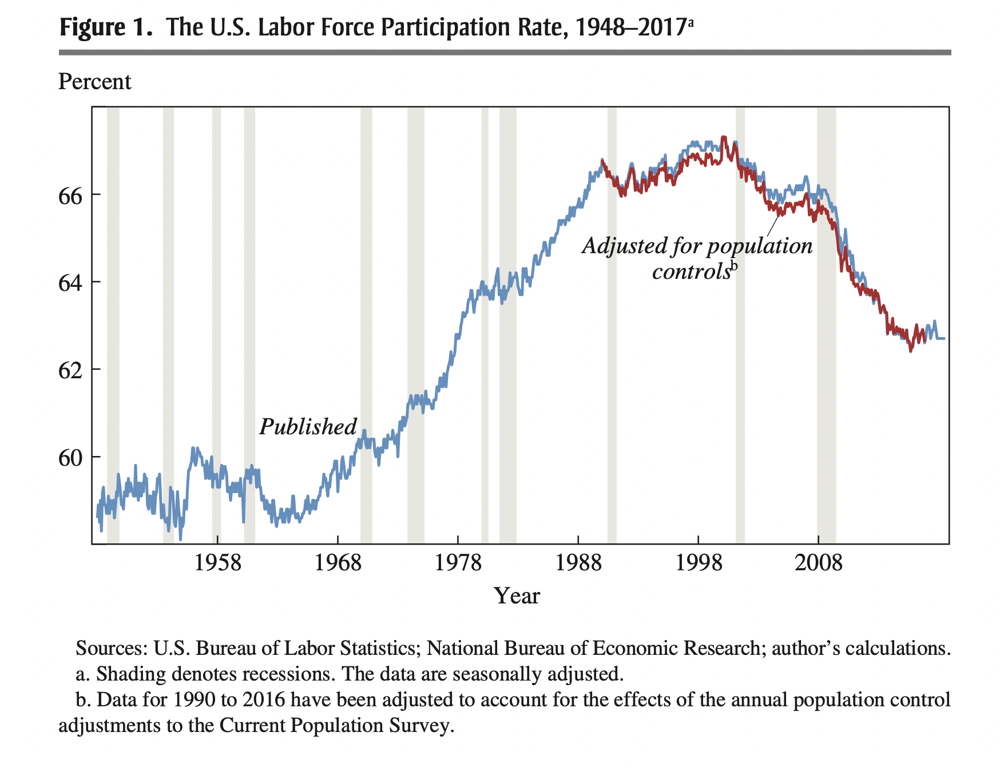
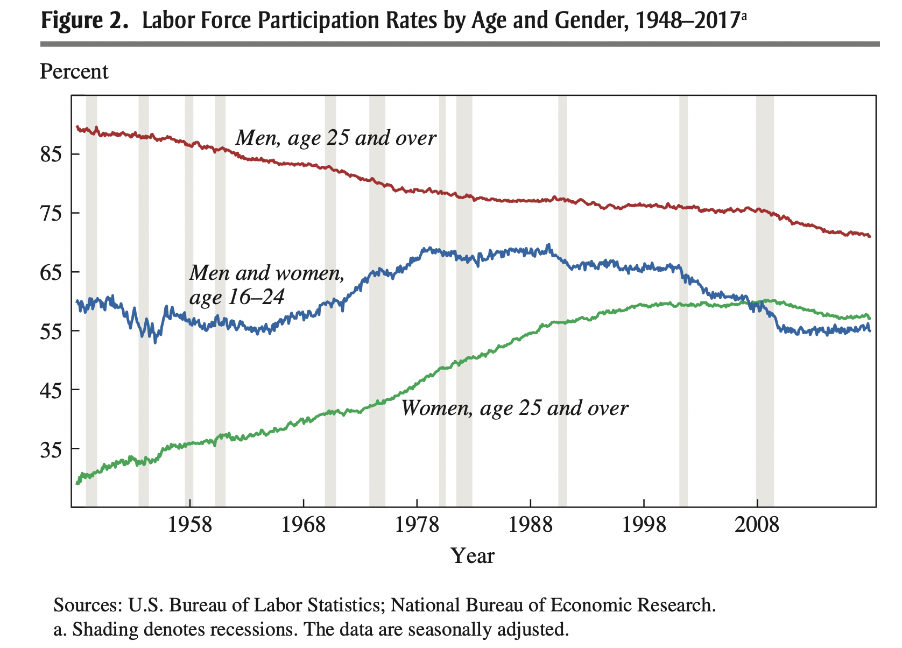
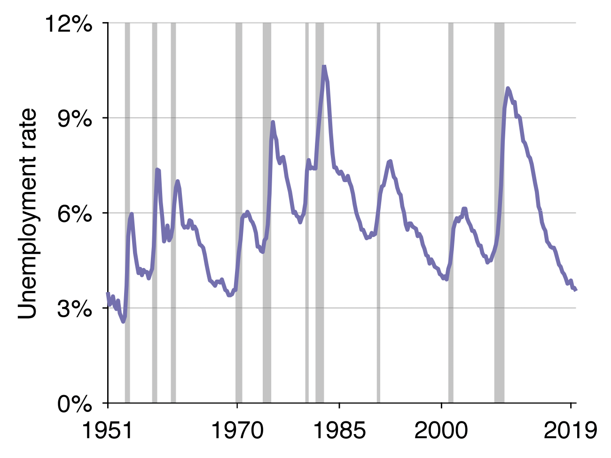
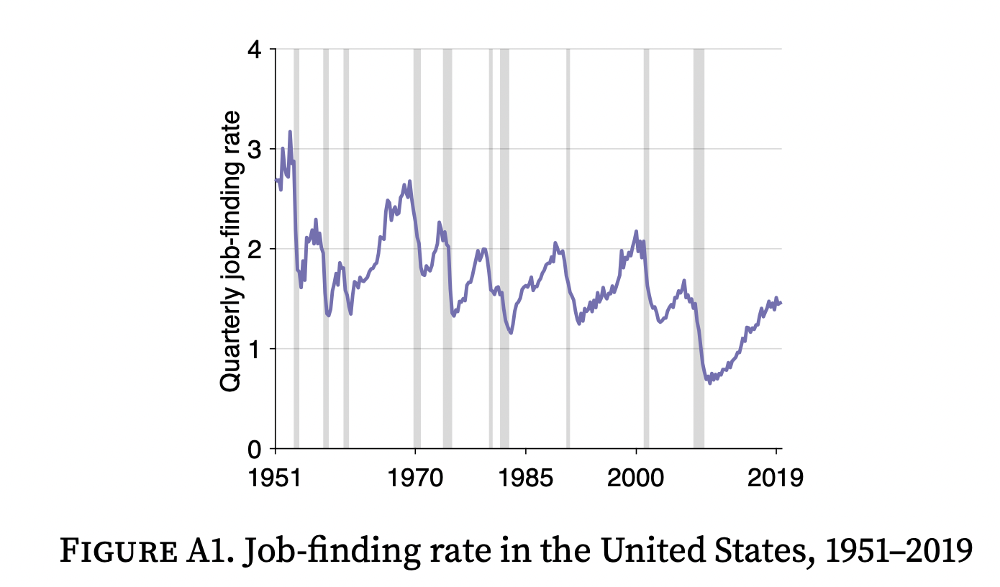

ECON 2080, part 1  
Spring 2022  
Pascal Michaillat  
Brown University

# Quiz 1: Answers

+ Question A: 2
+ Question B: 5
+ Question C: 3
+ Question D: 2
+ Question E: 4
+ Question F: 1
+ Question G: 3

[Illustration for Question B](https://www.brookings.edu/bpea-articles/where-have-all-the-workers-gone-an-inquiry-into-the-decline-of-the-u-s-labor-force-participation-rate/)

[Another illustration for Question B](https://www.brookings.edu/bpea-articles/where-have-all-the-workers-gone-an-inquiry-into-the-decline-of-the-u-s-labor-force-participation-rate/)

[Illustration for Question C](https://doi.org/10.1016/j.pubecp.2021.100009)

[Illustration for Question D](https://doi.org/10.1016/j.pubecp.2021.100009)

