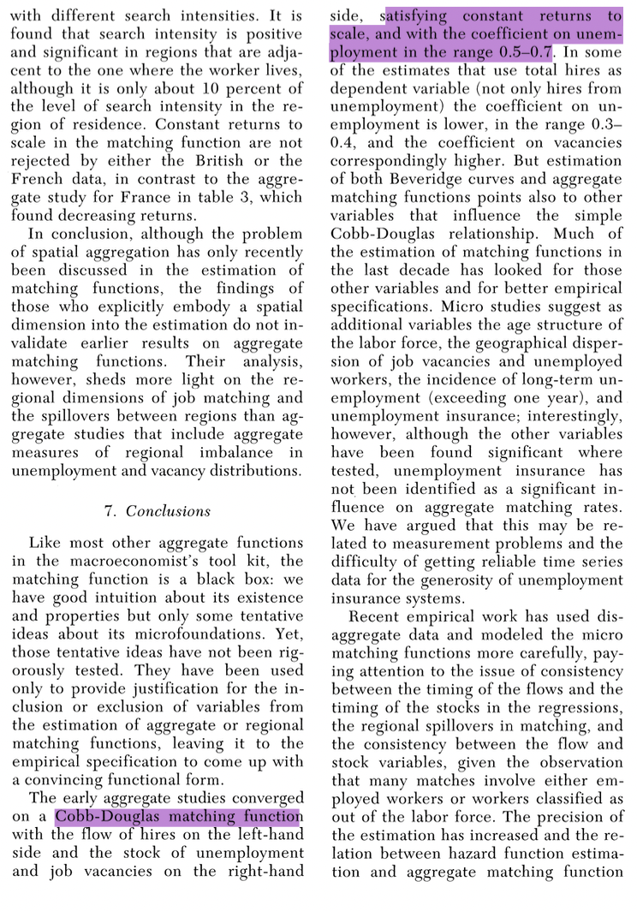
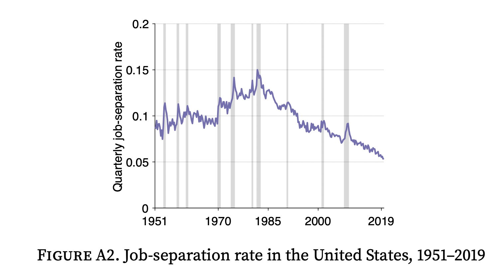
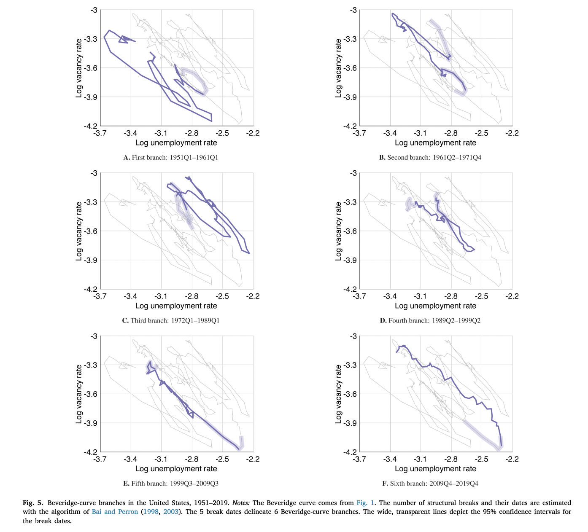
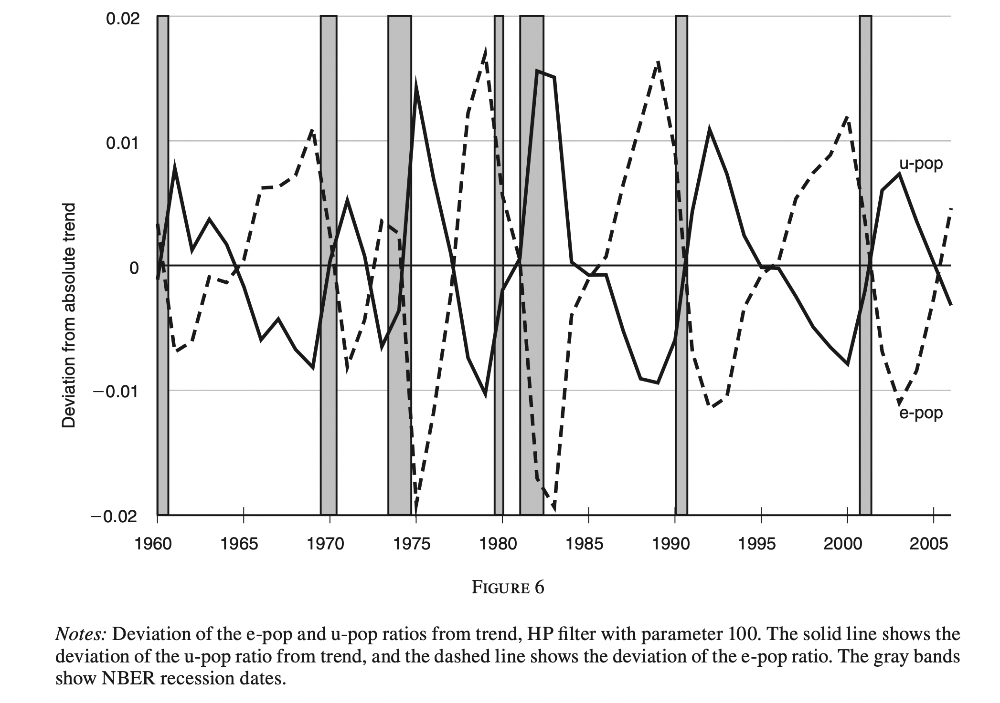
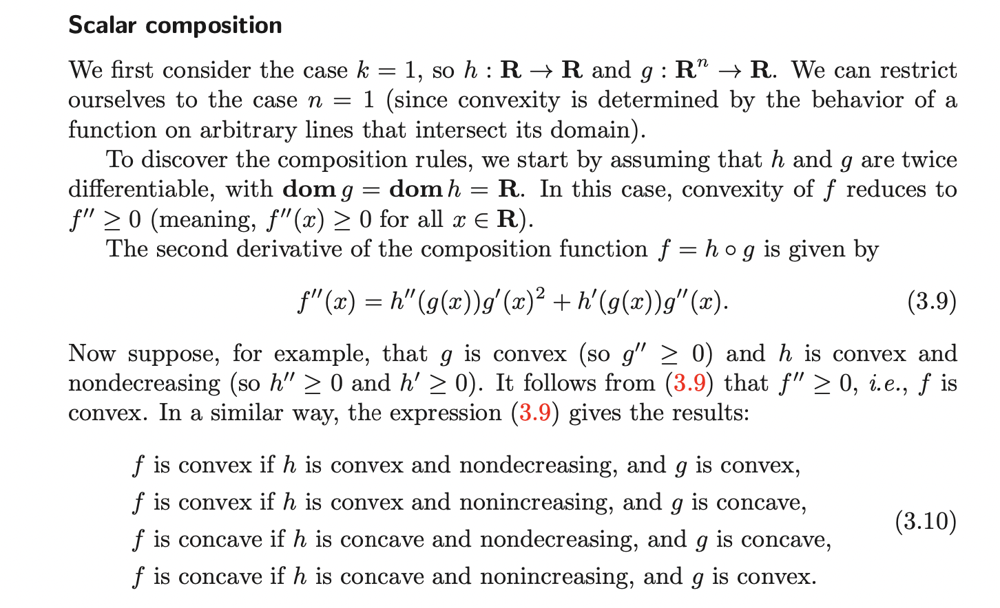

ECON 2080, part 1  
Spring 2022  
Pascal Michaillat  
Brown University

# Quiz 2: Answers

+ Question A: 2
+ Question B: 2
+ Question C: 4
+ Question D: 3
+ Question E: 5
+ Question F: 1
+ Question G: 1
+ Question H: 3
+ Question I: 1

[Reference for Question B](https://doi.org/10.1257/jel.39.2.390)

[Illustration for Question C](https://doi.org/10.1016/j.pubecp.2021.100009)

[Illustration for Question E](https://doi.org/10.1016/j.pubecp.2021.100009)

[Illustration for Question F](https://doi.org/10.1257/mac.1.1.280)

[Reference for Question I](https://web.stanford.edu/~boyd/cvxbook/bv_cvxbook.pdf)

