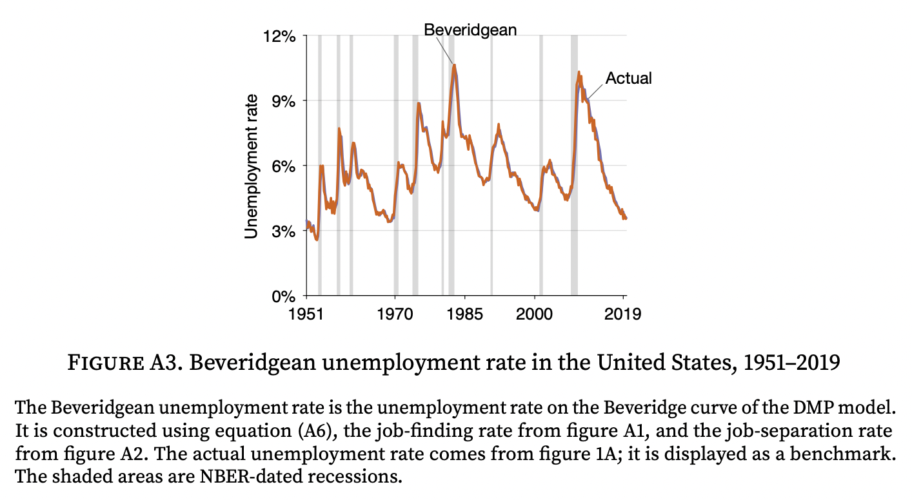

ECON 2080, part 1  
Spring 2022  
Pascal Michaillat  
Brown University

# Quiz 3: Answers

+ Question A: 4
+ Question B: 5
+ Question C: 2
+ Question D: 3
+ Question E: 6

[Illustration that flows are always almost balanced on the US labor market](https://doi.org/10.1016/j.pubecp.2021.100009)

